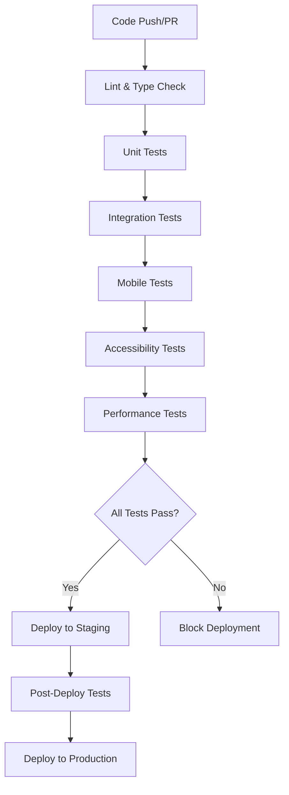

# 🧪 Testing Documentation

## Overview

This document describes the automated testing infrastructure for the BISCOIDINO website. Our testing suite ensures the reliability and quality of all main features across different devices and browsers.

## 🎯 Test Coverage

### Core Features Tested

1. **🧭 Navigation System**
   - Section switching (Home, Menu, About, Gallery, Contact)
   - Active link highlighting
   - Mobile responsive navigation
   - CTA button functionality

2. **🏠 Home Section**
   - Content display and layout
   - Physics canvas loading
   - CTA button navigation
   - Responsive design

3. **📋 Menu Section**
   - Product card display
   - Product modal opening
   - WhatsApp order links
   - Responsive grid layout

4. **🖼️ Gallery Section**
   - Image carousel functionality
   - Navigation controls (arrows, dots)
   - Drag/swipe gestures
   - Gallery modal integration

5. **📱 Modals**
   - **Product Modal**: Tab navigation, image carousel, zoom controls, physics simulation
   - **Gallery Modal**: Image zoom, touch gestures, accessibility

6. **📞 Contact Section**
   - WhatsApp link functionality
   - Contact information display
   - Responsive layout

7. **💾 PWA & Service Worker**
   - Service worker registration
   - Offline functionality
   - Manifest file validation
   - Cache management

## 🏗️ Test Architecture

### Testing Framework: Playwright
- **Cross-browser testing**: Chrome, Firefox, Safari
- **Mobile testing**: iPhone and Android emulation
- **Responsive testing**: Multiple viewport sizes
- **Accessibility testing**: ARIA compliance, keyboard navigation

### Test Types

#### 🧪 Unit Tests
- Individual component functionality
- Modal interactions
- Navigation logic
- Physics canvas operations

#### 🔄 Integration Tests
- Section-to-section navigation
- Modal opening/closing
- Service worker integration
- PWA functionality

#### 📱 Mobile Tests
- Touch interactions
- Swipe gestures
- Responsive layouts
- Mobile-specific features

#### ⚡ Performance Tests
- Lighthouse audits
- Loading time validation
- Resource optimization
- Core Web Vitals

## 🚀 CI/CD Pipeline

### Automated Workflows

1. **🧪 Test Workflow** (`.github/workflows/test.yml`)
   - Triggered on: Push to main/develop branches, Pull Requests
   - Runs: Complete test suite across all browsers
   - Includes: Mobile testing, accessibility, security scans

2. **🚀 Deploy Workflow** (`.github/workflows/deploy.yml`)
   - Triggered on: Successful test completion on main branch
   - Runs: Smoke tests before deployment
   - Includes: Post-deployment validation

3. **🔄 Health Check** (`.github/workflows/health-check.yml`)
   - Triggered on: Weekly schedule (Mondays 9 AM UTC)
   - Runs: Comprehensive health checks
   - Includes: Security audits, performance monitoring

### Test Execution Strategy



## 📊 Test Reports

### Available Reports
- **HTML Report**: Detailed test results with screenshots and videos
- **Mobile Report**: Mobile-specific test outcomes
- **Lighthouse Report**: Performance and PWA metrics
- **Accessibility Report**: WCAG compliance status

### Accessing Reports
- Reports are automatically uploaded as GitHub Actions artifacts
- Available for 30 days after test execution
- Downloadable from the Actions tab in GitHub

## 🛠️ Local Development

### Running Tests Locally

```bash
# Install dependencies
npm install

# Install Playwright browsers
npx playwright install

# Run all tests
npm run test

# Run tests with UI mode
npm run test:ui

# Run tests in headed mode (visible browser)
npm run test:headed

# Debug specific test
npm run test:debug
```

### Test Configuration

Tests are configured in `playwright.config.ts`:
- **Base URL**: `http://127.0.0.1:4173` (preview server)
- **Browsers**: Chromium, Firefox, WebKit
- **Mobile**: iPhone 12, Pixel 5 emulation
- **Retries**: 2 retries on CI, 0 locally
- **Timeout**: 30s per test

## 🔍 Test Structure

### Test Files Organization
```
tests/
├── navigation.spec.ts           # Navigation system tests
├── home-section.spec.ts         # Home page functionality
├── menu-section.spec.ts         # Product menu tests
├── gallery-section.spec.ts      # Image gallery tests
├── product-modal.spec.ts        # Product modal interactions
├── gallery-modal.spec.ts        # Gallery modal functionality
├── contact-section.spec.ts      # Contact information tests
└── pwa-service-worker.spec.ts   # PWA and offline tests
```

### Test Naming Convention
- Descriptive test names explaining what is being tested
- Grouped by feature using `test.describe()`
- Common setup in `test.beforeEach()`

## 🐛 Debugging Failed Tests

### Common Issues and Solutions

1. **Timing Issues**
   - Add appropriate `waitForTimeout()` calls
   - Use `waitForSelector()` for dynamic content
   - Increase timeout for slow operations

2. **Modal Issues**
   - Ensure modal is fully opened before interaction
   - Check for backdrop clicks interfering with tests
   - Verify escape key handlers

3. **Mobile Testing**
   - Use proper viewport sizes
   - Account for touch vs. mouse events
   - Test swipe gestures carefully

4. **Service Worker Issues**
   - Clear cache between tests if needed
   - Mock service worker for consistent testing
   - Test offline scenarios properly

## 📈 Performance Monitoring

### Metrics Tracked
- **First Contentful Paint (FCP)**
- **Largest Contentful Paint (LCP)**
- **Cumulative Layout Shift (CLS)**
- **First Input Delay (FID)**
- **Time to Interactive (TTI)**

### Thresholds
- Performance Score: > 90
- Accessibility Score: > 95
- Best Practices Score: > 90
- SEO Score: > 90
- PWA Score: > 90

## 🔒 Security Testing

### Automated Security Checks
- **npm audit**: Dependency vulnerability scanning
- **Snyk**: Advanced security analysis
- **HTTPS enforcement**: SSL certificate validation
- **CSP headers**: Content Security Policy verification

## 🎯 Future Enhancements

### Planned Improvements
1. **Visual Regression Testing**: Screenshot comparison for UI changes
2. **API Testing**: Backend endpoint validation (when applicable)
3. **Load Testing**: High traffic simulation
4. **Cross-device Testing**: Real device cloud integration
5. **A/B Testing**: Feature flag testing infrastructure

## 📞 Support

For questions about the testing infrastructure:
1. Check the test documentation and comments
2. Review failed test artifacts in GitHub Actions
3. Run tests locally to reproduce issues
4. Update tests when adding new features

## 🏆 Best Practices

1. **Write Descriptive Tests**: Each test should clearly describe what it validates
2. **Keep Tests Independent**: Tests should not depend on each other
3. **Use Page Object Pattern**: For complex interactions, consider page objects
4. **Mock External Services**: Use mocking for reliable, fast tests
5. **Regular Updates**: Keep tests updated with feature changes
6. **Performance Awareness**: Monitor test execution time and optimize slow tests